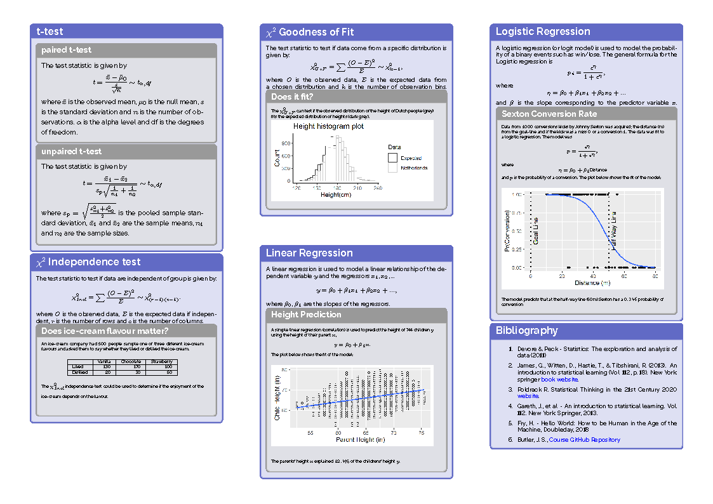

# Probability and Statistical Inference Summary Sheet
This repositry has the LaTex code to generate the Summary Sheet for the TU Dublin module Probability and Statistical Inference on the programmes the CPD in Data Analysis for Professional and the PG Dip in Applied Statistics.

